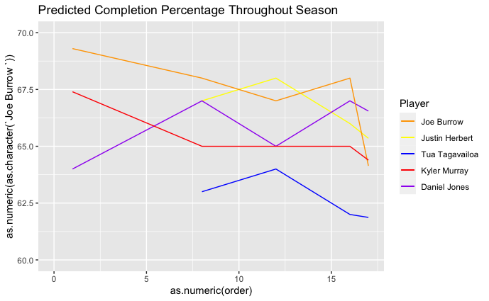
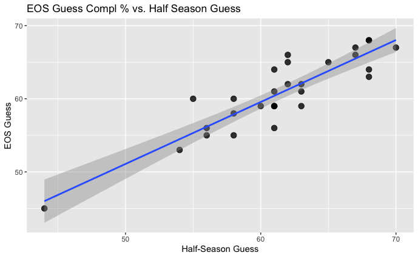

# Athletic Bayes
Implementing Bayes for finding "true" NFL completion percentages and NBA free-throw percentages. <br>
Author: Shariar Vaez-Ghaemi

## R Markdown

If you've only seen an NBA player shoot 3 free throws, and he makes all of them, would you consider him to be a 100% free-throw shooter? If you've only seen an NFL quarterback throw 4 passes, and he misses three of them, is he a 25%-completion QB?

I hope you answered no for both questions! While fun-sized datasets can provide *some* insight into a phenomenon, the statistics of those datasets are rarely the parameter of the population. But, that doesn't mean we lose all hope! Enter Bayes.

With Bayes Theorem and Maximum Likelihood Estimation, we can make educated guesses about a parameter using prior knowledge and a new sample of data.

Today, we're going to use Bayes Theorem to predict an NFL rookie quarterback's true completion percentage given their college completion percentage (prior) and their first few weeks of NFL completion percentages (new observations).

[](https://www.youtube.com/watch?v=IaRw1ZbTmhw)

## Defining Functions

We'll start by defining our Bayesian algorithm and its prerequisite functions. Here is the two-tailed probability density function. There are existing packages that implement this in R, but I thought it would be easiest to understand the concept with the math in front of you.

```{r Two-Tailed Probability Density Function}
prob_dens <- function(a,m,sd){
  return(dnorm(a,m,sd))
}
```

The above function only outputs the probability of seeing one datum, but in Bayes World, we want the probability of seeing a set of data. For example, instead of the prior probability of a player shooting 70%, we want the prior probability of them shooting 70% one night, then 68% the next night, then 42% the last night. The probability density function for multiple data points is below:

```{r Probability Density for Dataset}
prob <- function(vec,pm,psd){
  return(prod(sapply(vec,prob_dens,pm,psd)))
}
```

Now, we're finally ready to write the Maximum Likelihood Estimation Function. For every value between 0 and the value equal to twice the mean, we will find the posterior likelihood given the data. 

```{r Bayesian MLE}
bEst <- function(vec,m,sd){
  seq <- c(0:(2*m))
  posterior <- c()
  optimum <- 0
  for (val in seq){
    priorProb <- prob_dens(val,m,sd)
    likelihood <- prob(vec,val,sd)
    posterior <- append(posterior, priorProb*likelihood)
    if (priorProb*likelihood >= max(posterior)){
      optimum <- val
    }
  }
  #return(data.frame(seq,posterior))
  return(optimum)
}
```

So, it's time to see how this bad boy works, right? Not quite. We have to do a bit of...

## Data Pipeline Management

Let's input the completion percentage data as such. We'll have to remove Carson Wentz from consideration, not because he had an irreproducibly terrific rookie season, but because we don't have the standard deviation of his college completion percentages. Why? Because he's the only quarterback in this list who didn't play FBS football!

No need to worry about the omission. Much like the Eagles, we'll be better off without Wentz's presence, anyway.

``` {r inputting data}
df <- read.csv("PriorPosterior.csv")
df <- df[-c(17),] #Removing Wentz from the dataset
nfl <- df[,c(6:22)] #Dataframe with only NFL numbers
```

Right now, each entry in the vector is a single player's completion percentage for one game. We're going to want an ordered vector with all completion percentages, so let's create one and save it in the NFL dataframe.

```{r Creating vector with all CP's}
vecs <- c()
for (e in c(1:16,18:30)){
  vecs <- append(vecs,list(na.omit(as.numeric(nfl[e,]))))
}
vecs
df$vecs <- vecs
```

Now, we're ready to start our next step, which is...

## Implementing Bayes

First, let's run a Bayesian MLE with college completion percentage as the prior and the first *half* of rookie completion percentage numbers as new observations.

```{r Running Bayesian MLE with first half of regular season}
#Take first half of every vector
allHalfs <- list()
for (e in c(1:16,18:29)){
  vec <- unlist(df$vecs[e])
  l <- df$len[e]
  print(vec[1:l/2])
  #allHalfs <- append(allHalfs,as.numeric(vec[1:(l/2)]))
  allHalfs[[e]] <- as.numeric(vec[1:(l/2)])
}
df$halfs <- allHalfs

#Guess based on first half of data
halfGuess <- c()
for (e in c(1:29)){
  vecs <- df$halfs[e]
  m <- df$College[e]
  sd <- df$College.SD[e]
  halfGuess <- append(halfGuess,bEst(vecs,m,sd))
}

df$halfGuess <- halfGuess
```

That was fun, but let's try to use some more data. In this next section, we'll utilize the first 3/4 of a player's rookie data. Everything else remains the same.

```{r Running Bayesian MLE with first 3/4 of regular season}
#Take first 3/4 half of every vector
threefourth <- list()
for (e in c(1:17,18:29)){
  vec <- unlist(df$vecs[e])
  l <- df$len[e]
  #print(vec[1:l*3/4])
  #allHalfs <- append(allHalfs,as.numeric(vec[1:(l/2)]))
  threefourth[[e]] <- as.numeric(vec[1:(l*3/4)])
}

df$threefourth <- threefourth

#Guess based on first three fourths of data
guess34 <- c()
for (e in c(1:29)){
  vecs <- df$threefourth[e]
  m <- df$College[e]
  sd <- df$College.SD[e]
  guess34 <- append(guess34,bEst(vecs,m,sd))
}

df$threefourthguess <- guess34
```

Finally, we'll make a guess based of the entire rookie season's data.

```{r Bayesian MLE with full-season}
#Guess based on entire season
df$bGuess <- bEst(df$vecs,df$College,df$College.SD)
guess <- c()
for (e in c(1:17,18:29)){
  vecs <- df$vecs[e]
  m <- df$College[e]
  sd <- df$College.SD[e]
  guess <- append(guess,bEst(vecs,m,sd))
}
df$guess2 <- guess

#Bayesian Estimation Function
bEst <- function(vec,m,sd){
  seq <- c(0:(2*m))
  posterior <- c()
  optimum <- 0
  for (val in seq){
    priorProb <- prob_dens(val,m,sd)
    likelihood <- prob(vec,val,sd)
    posterior <- append(posterior, priorProb*likelihood)
    if (priorProb*likelihood >= max(posterior)){
      optimum <- val
    }
  }
  #return(data.frame(seq,posterior))
  return(optimum)
}
```

Finally, we're going to transform our dataset so that the dataframe we use for visualizations has a column for each player. There are many other ways to transform data for ggplot, but this one was the easiest for me. Note that *ndf2* (not ndf), will be the pipeline for graphing.

```{r Transforming Data for ggplot}
#Extract Guesses
df <- subset(df, select = c("College","CP.","Players"))
ndf <- subset(df,select=c("College","CP."))
ndf$collegeCP <- as.numeric(ndf$College)
ndf$half <- as.numeric(halfGuess)
ndf$tf <- as.numeric(guess34)
ndf$eos <- as.numeric(guess)
ndf$names <- df$Players

#Invert rows and columns
ndf2 <- data.frame(t(ndf[-1]))
colnames(ndf2) <- df$Players
ndf2 <- ndf2[-c(6),]
ndf2$order <- c(17,1,8,12,16)
ndf2$`Justin Herbert`
#GGplot into function (lapply later)
ggplot(ndf2,mapping=aes(order,`Joe Burrow `))
ggplot(ndf2,mapping=aes(order,`Justin Herbert`))
```

## Looking at Some Visualizations

Here are five players from the 2019 and 2020 NFL draft, along with the adjustments in their predicted completion percentage over the course of the season. With the exception of Joe Burrow, whose college completion percentage of 76% far out-shined everyone else in the dataset, most players' end-of-season Bayesian prediction was close to their actual completion percentage for the year.

```{r Prediction Visualization, echo=TRUE}
ggplot(ndf2,aes(x=as.numeric(order)))+
  xlim(min=0,max=17)+
  ylim(min=60,max=70)+
  geom_line(aes(y=as.numeric(as.character(`Joe Burrow `)), color = "orange"))+
  geom_line(aes(y=as.numeric(as.character(`Justin Herbert`)),color="yellow"))+
  geom_line(aes(y=as.numeric(as.character(`Tua Tagovailoa`)),color="blue"))+
  geom_line(aes(y=as.numeric(as.character(`Kyler Murray`)),color="red"))+
  geom_line(aes(y=as.numeric(as.character(`Daniel Jones`)),color="purple"))+
  labs(title="Predicted Completion Percentage Throughout Season",color="Player")+
  scale_color_manual(labels=c("Joe Burrow","Justin Herbert","Tua Tagavailoa","Kyler Murray","Daniel Jones"),
                              values=c("orange","yellow","blue","red","purple"))

```



Another thing to look at is how much our half-season guesses correlate with end-of-season guesses. According to the graph below, very much. This makes sense, because players who perform better in the first half of their rookie season generally perform better over all.

``` {r Half-Season vs EOS}
#Graph Half-Season guess against end-of-season completion
ndf %>%
  ggplot(aes(half,eos))+
  geom_point(size = 3, alpha = 0.8) +
  geom_smooth(method = glm, se = T)+
  labs(x = "Half-Season Guess", y = "EOS Guess", title = "EOS Guess Compl % vs. Half Season Guess")
  theme_minimal()  
```

